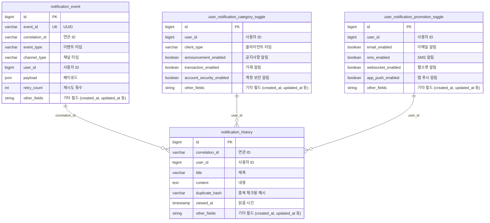

# Notification Service 구축 (1)

## 배경

기존 알림 시스템의 문제점:

- **파편화된 알림 채널**: 각 알림 채널마다 별도의 서비스로 분리되어 있었습니다. 이메일을 보내려면 email-gateway를, SMS를 보내려면 sms-gateway를, 실시간 알림을 보내려면 socket 서비스를 각각 호출해야 했습니다. 이러한 구조는 개발자가 알림을 보낼 때마다 여러 서비스를 개별적으로 호출해야 하는 번거로움을 야기했습니다.

- **FCM 미지원**: 앱 푸시 알림을 위한 FCM(Firebase Cloud Messaging) 전송 기능이 전혀 구현되어 있지 않았습니다. 모바일 앱 사용자에게 푸시 알림을 보낼 수 없는 상황이었으며, 이는 사용자 경험 측면에서 큰 제약이었습니다.

- **이력 관리 부재**: 알림 전송 이력 관리가 매우 취약했습니다. 알림이 성공적으로 전송되었는지, 실패했다면 어떤 이유로 실패했는지 확인하려면 각 서비스의 로그를 직접 확인해야 했습니다. 전송 성공/실패 여부를 한눈에 파악할 수 있는 중앙화된 관리 시스템이 없었습니다.

- **실패 처리 미흡**: 전송 실패에 대한 체계적인 추적이나 재시도 메커니즘이 없었습니다. 일시적인 네트워크 오류나 서비스 장애로 인한 실패를 복구할 방법이 없어, 알림이 실패하면 그대로 놓치게 되는 상황이었습니다.

- **고급 기능 부재**: 대량 전송이나 우선순위 전송 같은 고급 기능을 전혀 지원하지 않았습니다. 중요한 알림과 일반 알림을 구분하여 처리하거나, 많은 수의 알림을 효율적으로 전송하는 기능이 없어 비즈니스 요구사항을 충족하기 어려웠습니다.

이러한 문제점들을 해결하기 위해 모든 알림 채널을 통합하고, FCM 지원, 이력 관리, 실패 처리, 고급 기능을 제공하는 통합 Notification Service를 구축하게 되었습니다.

## 시스템 플로우

Notification Service의 기본적인 알림 전송 흐름입니다.

주요 흐름:

1. 일반 알림 전송: 직접 알림 요청을 받아 즉시 전송
2. 이벤트 처리: Kafka를 통한 비동기 알림 전송 처리
3. 채널 전략: PARALLEL 또는 PRIORITY 전략에 따른 전송 방식

### 1. 일반 알림 전송 플로우

엔드포인트: POST /notifications

가장 기본적인 알림 전송 흐름입니다.

단계별 설명

1. 요청 수신: HTTP POST 요청으로 알림 요청 수신
2. 사용자 설정 필터링: 사용자의 알림 설정에 따라 채널 필터링
3. 사용자 정보 채우기: 사용자 정보(이메일, 전화번호 등)로 채널 파라미터 자동 채우기
4. 멱등성 검사: 60초 내 동일한 요청 중복 방지
5. History 저장: NotificationHistory 테이블에 요청 기록 저장
6. 이벤트 생성 및 발행: 채널 전략에 따라 이벤트 생성 후 Kafka에 발행
7. Kafka 소비: 비동기로 이벤트 소비하여 실제 전송 수행

### 2. 이벤트 처리 및 전송 플로우

Kafka를 통해 비동기로 알림을 전송하는 흐름입니다.

주요 특징
- 멱등성 보장: 동일 이벤트 중복 처리 방지
- 재시도 메커니즘: 일시적 오류 시 자동 재시도 (최대 3회)
- 채널별 핸들러: 각 채널 타입별로 전용 핸들러가 처리
- DLQ: 최종 실패 시 Dead Letter Queue로 이동

### 3. 채널 전략

**PARALLEL 전략 (병렬)**  
모든 채널에 동시에 알림을 전송합니다.

**PRIORITY 전략 (우선순위)**  
우선순위에 따라 순차적으로 전송하며, 첫 번째 채널이 성공하면 나머지는 취소됩니다.

### 4. 이벤트 상태 전이

이벤트 타입
- REQUESTED: 전송 요청 (EMAIL_REQUESTED, SMS_REQUESTED 등)
- SUCCESS: 전송 성공 (EMAIL_SUCCESS, SMS_SUCCESS 등)
- RETRY: 재시도 필요 (EMAIL_RETRY, SMS_RETRY 등)
- FILTERED: 필터링됨 (스팸 등)
- FAIL: 최종 실패
- DLQ: Dead Letter Queue로 이동

## 데이터베이스 스키마

### ERD

### 테이블 설명

| 테이블명 | 목적 | 주요 특징 | 제약조건 |
|---------|------|----------|---------|
| **notification_event** | Event Sourcing 패턴을 사용한 알림 이벤트 저장 | • 모든 알림 이벤트를 불변(immutable)하게 저장 • 이벤트 타입별로 상태 추적 가능 • 재시도 및 실패 처리 추적 | - |
| **notification_history** | 사용자 알림 히스토리 및 읽음 상태 관리 | • 사용자가 받은 알림의 기록 • 읽음/안 읽음 상태 추적 (viewed_at) • 중복 요청 방지를 위한 duplicate_hash 사용 | - |
| **user_notification_category_toggle** | 사용자별, 클라이언트 타입별 알림 카테고리 활성화 설정 | • 사용자와 클라이언트 타입(WEB, APP) 조합별로 설정 관리 • 카테고리별 알림 on/off 제어 • 기본값: 모든 카테고리 활성화 (TRUE) | `(user_id, client_type) UNIQUE` |
| **user_notification_promotion_toggle** | 사용자별 프로모션 알림 채널 활성화 설정 | • 프로모션 알림에 대한 채널별 on/off 제어 • 사용자별로 하나의 설정만 존재 • 기본값: 모든 채널 활성화 (TRUE) | `user_id UNIQUE` |

### 테이블 간 관계

- **notification_event ↔ notification_history**: `correlation_id`로 연결. 하나의 알림 요청에 대해 여러 채널의 이벤트가 발생할 수 있음
- **user_notification_category_toggle ↔ notification_history**: `user_id`로 연결. 사용자의 카테고리별 알림 설정에 따라 알림이 필터링됨
- **user_notification_promotion_toggle ↔ notification_history**: `user_id`로 연결. 프로모션 알림의 경우 채널별 설정에 따라 필터링됨 